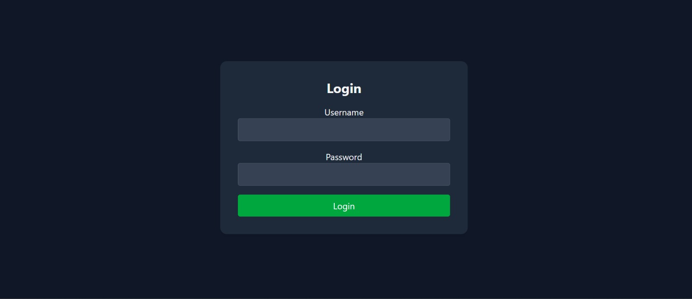
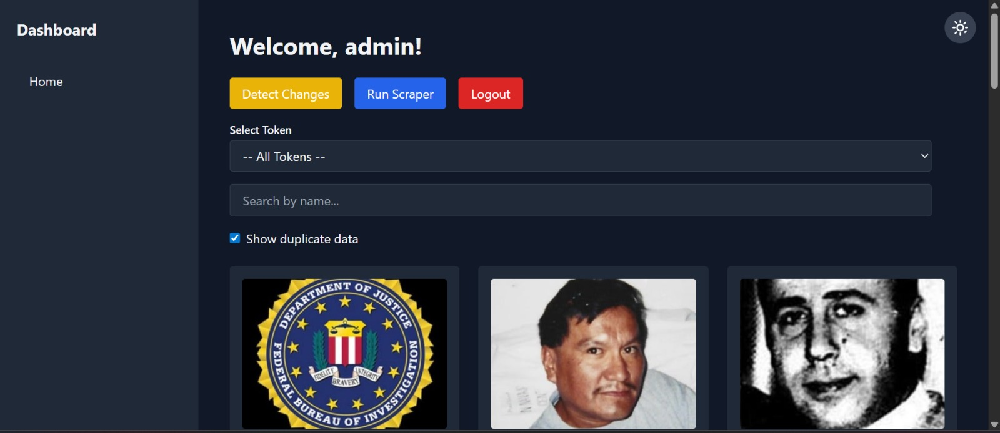
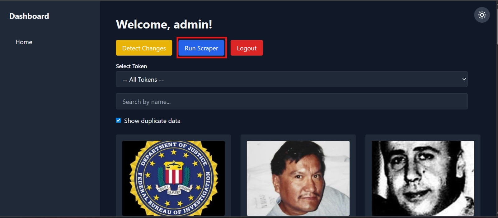
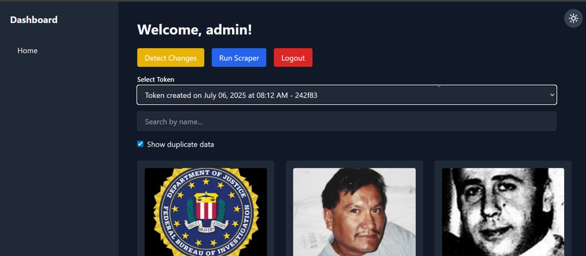
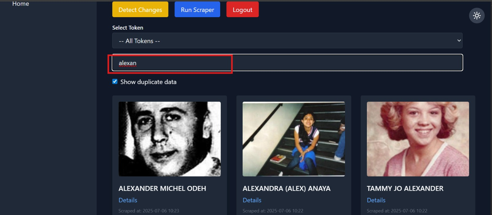
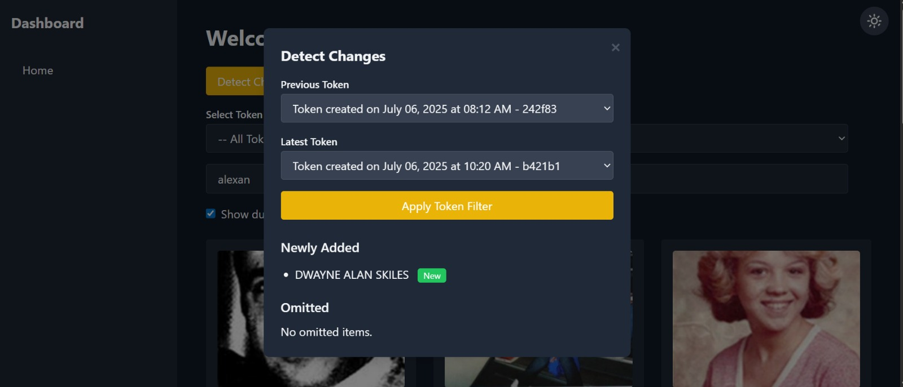
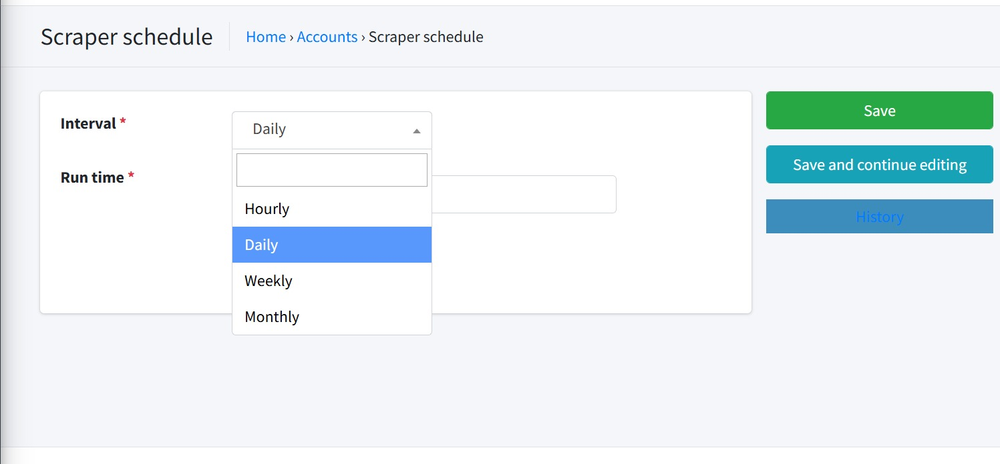
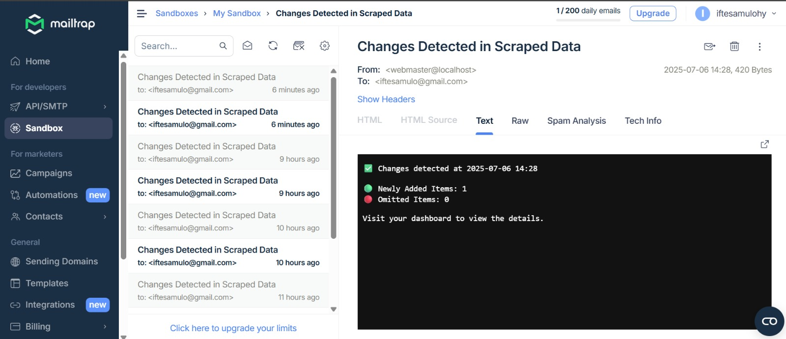

# 🕷️ Web Scraping Automation Project

<div align="center">
  
  
  
  
  
</div>

<div align="center">
  <h3>🚀 Robust Web Scraping Automation with Django Integration</h3>
  <p>A production-ready web scraping solution designed for efficiency, scalability, and data integrity.</p>
</div>

---

## 📚 Table of Contents

- [🎬 Project Demo](#-project-demo)
- [📌 Project Overview](#-project-overview)
- [🖼️ Feature Screenshots](#️-feature-screenshots)
- [✨ Features](#-features)
- [🚀 Deploy on Your Local Machine](#-deploy-on-your-local-machine)
- [☁️ Deploy on AWS EC2 with Gunicorn and Nginx](#️-deploy-on-aws-ec2-with-gunicorn-and-nginx)
- [📁 Repository](#-repository)

---

## 🎬 Project Demo

[](https://www.youtube.com/watch?v=ppg-4cH4cac)

🎬 **Watch the video overview**: [Click here to see how the project works in action »](https://www.youtube.com/watch?v=ppg-4cH4cac)

---

## 📌 Project Overview

This is a web scraping automation project designed to efficiently collect and process data from specific online sources. The scraper is built with robustness and scalability in mind, using modern Python libraries and Django integration to store and manage the collected data. The system also includes support for image downloading, file storage, duplicate detection, and scheduled scraping.

---

## 🖼️ Feature Screenshots

### 🔐 User Authentication System

<div align="center">
  
  <p><em>Secure login interface with modern dark theme design</em></p>
</div>

The application features a clean and intuitive login system that provides:
- **Secure Authentication** - Username and password-based login
- **Modern UI Design** - Dark theme with professional styling
- **Responsive Layout** - Optimized for all device sizes
- **User-Friendly Interface** - Simple and straightforward login process

### 📊 Interactive Dashboard with Infinite Scroll

<div align="center">
  
  <p><em>Comprehensive dashboard with infinite scrolling and advanced filtering capabilities</em></p>
</div>

The dashboard provides powerful data management and visualization features:
- **Infinite Scrolling** - Seamless browsing through large datasets without pagination
- **Advanced Search & Filtering** - Search by name and filter by tokens with real-time results
- **Duplicate Data Detection** - Toggle to show/hide duplicate entries for data quality control
- **Action Controls** - Quick access to detect changes, run scraper, and logout functionality
- **Visual Data Display** - Grid-based layout showing scraped images and data in an organized manner
- **Responsive Design** - Optimized interface that works across all device sizes
- **Dark Theme Consistency** - Maintains the modern dark aesthetic throughout the application

### ⚡ Automated Scraper Execution

<div align="center">
  
  <p><em>Real-time scraper execution with highlighted action controls and status indicators</em></p>
</div>

The scraper execution interface demonstrates the core automation functionality:
- **One-Click Execution** - Highlighted "Run Scraper" button for immediate scraping operations
- **Real-Time Processing** - Live execution of scraping tasks with visual feedback
- **Action Prioritization** - Clear visual emphasis on the primary scraper control
- **Integrated Workflow** - Seamless integration with dashboard controls and data management
- **Status Monitoring** - Visual indicators showing scraper activity and execution state
- **User Control** - Easy access to start, monitor, and manage scraping operations
- **Professional Interface** - Consistent design language with intuitive user experience

### 🎯 Token-Based Data Filtering

<div align="center">
  
  <p><em>Advanced token-based filtering system with detailed metadata and timestamp tracking</em></p>
</div>

The token-based filtering system provides sophisticated data management capabilities:
- **Token Selection** - Dropdown interface showing specific token details with creation timestamps
- **Metadata Display** - Comprehensive token information including creation date, time, and unique identifiers
- **Precision Filtering** - Filter data by specific tokens (e.g., "Token created on July 06, 2025 at 08:12 AM - 242f83")
- **Search Integration** - Combined token filtering with name-based search functionality
- **Data Quality Control** - Duplicate data toggle for maintaining clean datasets
- **Timestamp Tracking** - Detailed temporal information for audit trails and data lineage
- **Professional Interface** - Consistent dark theme with clear visual hierarchy and intuitive controls

### 🔍 Smart Search Functionality

<div align="center">
  
  <p><em>Intelligent search system with real-time filtering and highlighted results</em></p>
</div>

The smart search functionality delivers powerful data discovery capabilities:
- **Real-Time Search** - Instant filtering as you type with highlighted search terms
- **Intelligent Matching** - Advanced search algorithm that finds relevant results (e.g., searching "alexan" matches "Alexander", "Alexandra", "Tammy Jo Alexander")
- **Visual Result Highlighting** - Clear visual emphasis on search input with red border highlighting
- **Comprehensive Results** - Displays matching records with full profile information and timestamps
- **Search Integration** - Seamlessly works with token filtering and duplicate data controls
- **Performance Optimized** - Fast search response even with large datasets
- **User Experience** - Intuitive search interface with immediate visual feedback
- **Data Context** - Shows complete record details including scraping timestamps and profile images

### 🔄 Advanced Change Detection System

<div align="center">
  
  <p><em>Sophisticated change detection modal with token comparison and differential analysis</em></p>
</div>

The change detection system provides comprehensive data monitoring and comparison capabilities:
- **Token Comparison** - Compare data between different scraping sessions using specific tokens
- **Previous vs Latest Analysis** - Side-by-side comparison of historical and current data states
- **Newly Added Detection** - Automatically identifies and highlights new entries with green "New" badges
- **Omitted Items Tracking** - Monitors and reports items that were removed or no longer available
- **Modal Interface** - Clean, focused modal design for detailed change analysis
- **Token Selection** - Dropdown menus for selecting specific tokens to compare (e.g., "242f83" vs "b421b1")
- **Apply Filter Integration** - Seamless integration with main dashboard filtering system
- **Data Integrity Monitoring** - Ensures data consistency and tracks changes over time
- **Professional UI** - Consistent dark theme with clear visual hierarchy and intuitive controls

### ⏰ Automated Scraper Scheduler

<div align="center">
  
  <p><em>Comprehensive scheduling system with flexible interval configuration and automated execution</em></p>
</div>

The automated scheduler provides enterprise-level task automation capabilities:
- **Flexible Scheduling Intervals** - Configure scraping frequency with multiple options (Hourly, Daily, Weekly, Monthly)
- **Custom Run Time Configuration** - Set specific execution times with precise scheduling controls
- **Dropdown Selection Interface** - User-friendly dropdown menus for easy interval selection
- **Save and Continue Editing** - Multiple save options for workflow flexibility and iterative configuration
- **History Tracking** - Built-in history functionality to monitor past scheduled executions
- **Breadcrumb Navigation** - Clear navigation path showing Home → Accounts → Scraper schedule
- **Form Validation** - Required field indicators (*) ensuring proper configuration
- **Professional Interface** - Clean, light-themed design with intuitive form controls
- **Automated Execution** - Set-and-forget automation for consistent data collection
- **Enterprise Features** - Production-ready scheduling with robust error handling and monitoring

### 📧 Intelligent Email Notification System

<div align="center">
  
  <p><em>Professional email notification system with detailed change reports and dashboard integration</em></p>
</div>

The email notification system provides comprehensive automated alerting capabilities:
- **Automated Change Alerts** - Instant email notifications when changes are detected in scraped data
- **Professional Email Interface** - Integration with Mailtrap for reliable email delivery and testing
- **Detailed Change Reports** - Comprehensive email content showing specific changes with timestamps
- **Real-Time Statistics** - Email displays newly added items count and omitted items tracking
- **Dashboard Integration** - Direct links to view detailed changes in the main dashboard
- **Email History Tracking** - Complete inbox management with timestamped notification history
- **Multi-Format Support** - HTML, Text, Raw, and Spam Analysis views for comprehensive email handling
- **Production Email Service** - Enterprise-grade email delivery with 1/200 daily email limits
- **Sandbox Environment** - Safe testing environment for email notifications during development
- **User Account Management** - Personalized email notifications sent to specific user accounts
- **Technical Information** - Detailed email headers and technical analysis for debugging and monitoring

---

## ✨ Features

### 🔥 Core Functionality
- **Automated Data Collection** - Intelligent scraping with configurable targets
- **Django Integration** - Robust backend with ORM and admin interface
- **MySQL Database** - Reliable data storage with relationship management
- **Image Processing** - Automatic image downloading and optimization
- **Duplicate Detection** - Smart algorithms to prevent data redundancy

### 🎯 Advanced Capabilities
- **Scheduled Scraping** - Automated execution with cron job support
- **Error Handling** - Comprehensive error tracking and recovery
- **Rate Limiting** - Respectful scraping with customizable delays
- **Data Validation** - Built-in validation for data integrity
- **Logging System** - Detailed logs for monitoring and debugging

### 🛡️ Production Ready
- **Scalable Architecture** - Designed for high-volume data processing
- **Security Features** - Environment-based configuration and secure deployment
- **Monitoring Tools** - Performance tracking and health checks
- **Cloud Deployment** - AWS EC2 ready with Nginx and Gunicorn

---

## 🚀 Deploy on Your Local Machine

Follow the steps below to run the project locally.

### Prerequisites

Make sure you have the following installed:
- **Python 3.9+** - Latest Python version
- **MySQL** - Database server (via XAMPP or standalone)
- **Git** - Version control system

### 1. 🔁 Clone the Repository

```bash
git clone https://github.com/iftesamulohy/scraperautomation.git
cd scraperautomation
```

### 2. 🐍 Create a Virtual Environment

```bash
python -m venv env
source env/bin/activate  # Windows: env\Scripts\activate
```

### 3. 📦 Install Dependencies

```bash
pip install -r requirements.txt
```

### 4. ⚙️ Set Environment Variables

Create a `.env` file in the root directory and add your database credentials:

```env
DB_NAME=your_database_name
DB_USER=your_database_user
DB_PASSWORD=your_database_password
DB_HOST=127.0.0.1
DB_PORT=3306
SECRET_KEY=your_django_secret_key
DEBUG=True
```

> ☑️ Make sure `.env` is listed in `.gitignore`.

### 5. 🛠 Set Up MySQL Using XAMPP

- Start **Apache** and **MySQL** via the XAMPP Control Panel.
- Open [http://localhost/phpmyadmin](http://localhost/phpmyadmin)
- Create a new database with the name you set in `.env`.

### 6. 🔨 Run Migrations

```bash
python manage.py migrate
```

### 7. 📥 Load Initial Data

```bash
python manage.py loaddata data.json
```

### 8. 🚦 Start the Server

```bash
python manage.py runserver
```

Now open your browser and visit:  
👉 [http://127.0.0.1:8000](http://127.0.0.1:8000)


### 9. 🚦 Login Credentials

```bash
Username: admin
Password: admin
```

---

## ☁️ Deploy on AWS EC2 with Gunicorn and Nginx

Follow the steps below to deploy the project on an AWS EC2 instance.

### Prerequisites

- **AWS EC2 Instance** - Ubuntu 20.04 LTS or newer
- **Security Groups** - Allow HTTP (80), HTTPS (443), and SSH (22)
- **Domain Name** - Optional, but recommended for production

### Automated Deployment Script

```bash
#!/bin/bash

# Update and upgrade system
sudo apt update && sudo apt upgrade -y

# Install necessary packages
sudo apt install -y python3-pip python3-venv nginx git supervisor

# Clone project repo
cd /home/ubuntu || exit
git clone https://github.com/iftesamulohy/scraperautomation.git
cd scraperautomation || exit

# Create and activate virtual environment
python3 -m venv env
source env/bin/activate

# Upgrade pip and install gunicorn plus requirements
pip install --upgrade pip
pip install gunicorn
pip install -r requirements.txt

# NOTE: Create your .env file manually with proper credentials before continuing

# Run migrations and collect static files
python manage.py migrate
python manage.py collectstatic --noinput

# Create Gunicorn supervisor config
sudo tee /etc/supervisor/conf.d/gunicorn.conf > /dev/null <<EOF
[program:gunicorn]
directory=/home/ubuntu/scraperautomation
command=/home/ubuntu/env/bin/gunicorn --workers 3 --bind unix:/home/ubuntu/scraperautomation/app.sock scraperautomation.wsgi:application
autostart=true
autorestart=true
user=ubuntu
stderr_logfile=/var/log/gunicorn/gunicorn.err.log
stdout_logfile=/var/log/gunicorn/gunicorn.out.log

[group:guni]
programs=gunicorn
EOF

# Reload and start supervisor service
sudo supervisorctl reread
sudo supervisorctl update
sudo supervisorctl start gunicorn

# Setup Nginx site config
sudo tee /etc/nginx/sites-available/scraperautomation > /dev/null <<EOF
server {
    listen 80;
    server_name <your-ec2-public-ip-or-domain>;

    location / {
        include proxy_params;
        proxy_pass http://unix:/home/ubuntu/scraperautomation/app.sock;
    }
}
EOF

# Enable Nginx site and restart service
sudo ln -sf /etc/nginx/sites-available/scraperautomation /etc/nginx/sites-enabled/
sudo nginx -t
sudo systemctl restart nginx

# Setup firewall rules
sudo ufw allow OpenSSH
sudo ufw allow 'Nginx Full'
sudo ufw --force enable

echo "Deployment finished! Visit http://<your-ec2-public-ip>/"
```

### Manual Deployment Steps

1. **Launch EC2 Instance**
   - Choose Ubuntu 20.04 LTS AMI
   - Configure security groups for HTTP/HTTPS/SSH
   - Connect via SSH

2. **Run Deployment Script**
   ```bash
   chmod +x deploy.sh
   ./deploy.sh
   ```

3. **Configure Environment Variables**
   ```bash
   nano .env
   # Add your production credentials
   ```

4. **SSL Certificate (Optional)**
   ```bash
   sudo apt install certbot python3-certbot-nginx
   sudo certbot --nginx -d your-domain.com
   ```

---

## 📁 Repository

GitHub Repo: [https://github.com/iftesamulohy/scraperautomation](https://github.com/iftesamulohy/scraperautomation)

---

<div align="center">
  <p>Made with ❤️ for efficient web scraping automation</p>
  <p>
    <a href="#-web-scraping-automation-project">Back to Top</a>
  </p>
</div>